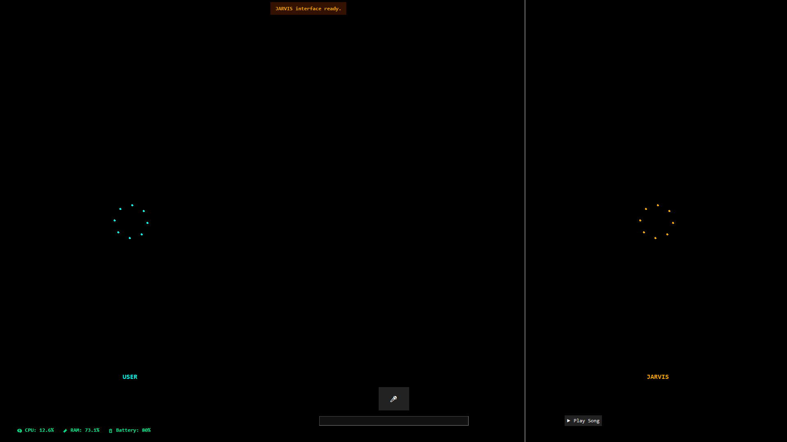
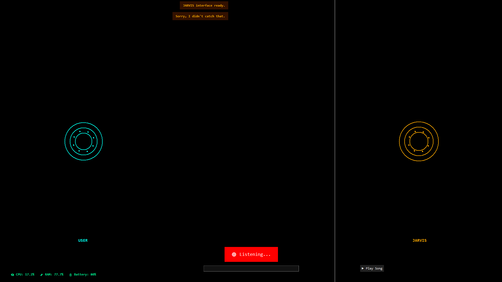

# JARVIS GUI (Basic Version) 💬🧠

This is a **simple desktop voice assistant** inspired by Iron Man's JARVIS.  
It runs in a fullscreen futuristic GUI and supports basic voice interactions, system monitoring, and music playback.

> ⚠️ **Note**: This is a beginner-level project and not a full AI system.  
> Ideal for learning GUI design, voice input, and basic animation in Python.

---

## 🧠 Features

- 🎙️ Microphone input using speech recognition  
- 🔊 Text-to-speech responses via `pyttsx3`  
- 🌀 Animated waveforms for user and assistant  
- 🌌 Background animations (starfield + radar HUD)  
- 💬 Chat bubble interface (user on left, AI on right)  
- 📊 System monitor: CPU, RAM, Battery  
- 🎵 Play songs on YouTube (voice or typed input)

---

## 📷 Screenshot




---

## 📦 Requirements

Install these Python packages:

```
pip install pyttsx3 SpeechRecognition pyaudio pywhatkit psutil
```

---

## 🚀 Run It

Run from terminal or your IDE:

```
python jarvis.py
```

---

## 📌 Notes

- ❌ This is not a real AI like ChatGPT or Google Assistant  
- ✅ There is no GPT or large language model integrated (yet)  
- 💡 Built entirely with `tkinter` and native Python features

---

## 🔮 Future Ideas

- 🤖 Add GPT/OpenAI integration  
- 🧠 Save memory (user name, preferences, reminders)  
- 🔌 Plugin loader (custom Python skills)  
- 📁 Save/load conversations  
- 🎨 Theme switcher (dark/light)

---

## 🛠 Built With

- `tkinter` – for the UI  
- `pyttsx3` – for speech synthesis  
- `SpeechRecognition` – for microphone input  
- `pywhatkit` – for YouTube music control  
- `psutil` – for system stats (CPU, RAM, Battery)

---

## 💬 Contact

Feel free to fork, contribute, or reach out with ideas!

---
